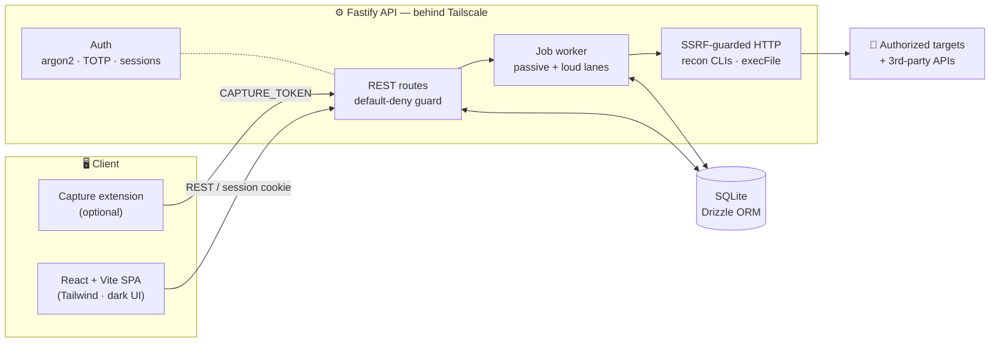

<div align="center">

# 🛰️ Recon Dashboard

### A single-operator, self-hosted red team attack-surface & recon platform

*Passive-first reconnaissance, exposure monitoring, OSINT aggregation and gated active scanning — all from the browser, no terminal required.*

<br>

[](./LICENSE)
[](https://github.com/Maiiaa30/ReconDashboard/actions/workflows/ci.yml)
[](#)
[](#-legal--ethical-use)

<br>


</div>

---

> [!WARNING]
> ## ⚖️ Legal & Ethical Use
> This is **offensive security tooling**. Run it **only** against systems you own or are **explicitly authorized in writing** to test. Unauthorized scanning, fuzzing or exploitation is illegal in most jurisdictions. Active/loud modules are gated behind an explicit per-domain `active_authorized` flag *by design* — that gate is a safeguard, not a suggestion. **You alone are responsible for how you use this software.** See the [disclaimer](#-disclaimer).

---

## ✨ Overview

**Recon Dashboard** is a personal, single-user platform for tracking assets and reconnaissance data across authorized engagements. It leans **passive-first** — pulling everything it safely can without touching the target — and keeps the loud, active tooling behind explicit authorization gates. Everything runs **server-side as background jobs** and is driven entirely from a dark, modern web UI. No terminal, no copy-pasting tool output.

- 🔎 **Passive-first recon** — certificate transparency, DNS, WHOIS, tech fingerprinting, archived-URL sources, cloud-bucket enumeration and "Shodan-of-each-domain" exposure (ASN, TLS-cert SANs, CVEs), all keyless where possible — plus an optional **public-code leak search** (GitHub) for the target's leaked keys and internal URLs.
- 🚨 **Continuous monitoring** — per-domain auto-recon on a schedule, subdomain diffing, a new-CVE-on-known-asset watch, and instant **Discord alerts** the moment a new subdomain appears. A **"Today" panel** on the home page surfaces what changed or got riskier *since you last looked* — new high-risk findings, new CVEs, new login-page subdomains, and authorization windows about to expire.
- 🎯 **Gated active scanning & confirmation** — `nmap`, `nuclei`, `ffuf` (recursion · vhost · fingerprint-aware wordlists), `sqlmap` and friends, locked behind `active_authorized`, an engagement scope (allow/deny) and an authorization window. It doesn't just *find* — it **proves**: **nuclei-driven CVE verification** promotes a passive "CVE present" signal to *confirmed-exploitable* with the PoC attached, an **IDOR / broken-authorization** helper replays one object request under three identities to flag access-control gaps, **parameter discovery** finds honored-but-undocumented params, and the OWASP engine confirms **SSTI**, open-redirect and CORS with false-positive-killing differentials — never fired at an unauthorized target.
- 🧠 **Intelligence & triage** — deterministic rules-based scoring, **attack-path correlation** rendered as a network graph, an optional AI advisor, **suggest-only AI triage** (the LLM proposes a disposition per finding; you apply with one click — it never changes anything itself), and **immutable engagement report snapshots** you can **export to PDF**.
- 🧰 **Request workbench** — a server-side **Repeater** (compose/replay any request, decoded body + sandboxed rendered preview + per-target history), a real **Intruder** (four attack modes — sniper / battering-ram / pitchfork / cluster-bomb — over numbered `{{P1}}…{{Pn}}` positions, with grep-extract/match columns, median + MAD anomaly detection and a bounded concurrency pool), a curated **payload library + encoder chain**, session-wide **match/replace rules** (inject an auth header, swap a CSRF token — applied *inside* the SSRF-guarded sender), an **Authz** diff mode for IDOR hunting, and a **Sitemap** that assembles the target's endpoint tree from captured + discovered data for one-click loading — fed by an optional **browser capture extension** that streams your in-scope traffic into a **Traffic** view. Findings can carry **attached request/response evidence** that flows straight into the report.
- 🕵️ **People & LLM security** — passive people/account **OSINT** pivots, domain **breach-exposure** lookups, and an **OWASP-Top-10-for-LLMs** red-team testing reference.
- ⌨️ **Operator-first UX** — grouped navigation with a **collapsible sidebar**, a **Ctrl-K command palette**, **toast + desktop notifications when a scan/tool starts and finishes**, in-app **confirmation dialogs** (no native browser popups), skeleton loaders, a mobile-friendly drawer, Markdown notes (push to Discord) and an auto-saved Excalidraw canvas.
- 🔐 **Built to be private** — single hardened login with optional TOTP 2FA, meant to live behind Tailscale, encrypted database backups you control, and CI-tested security rails.

---

## 🧩 Modules

The sidebar is grouped into **Overview · Recon · OSINT & Leaks · Offensive · Capture & Replay · Workspace · System**.

| Module | What it does | Mode |
| --- | --- | :---: |
| **Home** | Engagement dashboard — a **"Today" panel** ranking what changed / got riskier since your last visit (new high-risk findings, new CVEs, new login-page subdomains, expiring authorization windows), plus KPI vitals, attention buckets (never-scanned / new subs / high-risk), top open findings and recent-CVE changes | — |
| **Domains** | Track targets; per-domain `passive_only` / `active_authorized` mode; engagement scope (allow/deny hosts + CIDRs) + authorization window; scheduled auto-monitoring; **one-click Run recon** (discovery → exposure → screenshots + OSINT + origin discovery, plus nmap on active targets) | — |
| **Intel** | Rules-based triage + **attack-path correlation** as a force-directed **network graph**; optional **AI advisor** (prioritized, gated testing plan) | — |
| **Methodology** | Recon-skills coverage per target — which methodologies apply, per-step found / done / todo, one-click run, manual overrides | — |
| **Subdomains** | Passive discovery (crt.sh · certspotter · subfinder), HTTP-probe enrichment, **sortable by status / host / IP / last-seen**, diff & flag new, Discord alerts, exports | 🟢 passive |
| **Screenshots** | Headless-Chromium gallery with lightbox | 🟢 passive |
| **Exposure** | "Shodan of each domain" via InternetDB + cvedb — ports, CVEs, CPEs — plus **ASN / reverse-IP** and **TLS-cert SAN** harvest; interesting ports flagged | 🟢 passive |
| **Ports** | Every open port across the target (from Exposure + nmap), de-duped and filterable, showing **state** (open / filtered) and **nmap service/version**, with **port intelligence** — cameras/DVR, ICS & building-automation, databases, remote-access and admin panels auto-flagged by risk | 🟢 passive |
| **API Surface** | Passive **API recon** — discovers **OpenAPI/Swagger** specs (enumerates operations *with their params + request-body shape*, servers, auth schemes) and **GraphQL** endpoints (flags **introspection left enabled**, lists the callable operations + arg types), endpoints mined from the site's own **JavaScript** (+ baked-in `VITE_PUBLIC_*` config), a **per-host discovery selector**, a **one-click Send to Replay** for any operation, and a client-side **JWT inspector**. Nuclei presets add `graphql` · `swagger` · `jwt` · `oauth` | 🟢 passive |
| **OSINT** | DNS · WHOIS · cert transparency · zone-transfer · tech fingerprint · archived URLs (Wayback / CommonCrawl / urlscan / OTX) · **cloud-bucket enum** | 🟢 passive |
| **Social Forensics** | Passive people/account **OSINT** — pivot a username / email / name / phone into public-profile, search-dork and breach-lookup links, plus a people-OSINT methodology | 🟢 passive |
| **Data Leaks** | Domain **breach exposure** — configurable provider (HIBP / DeHashed / LeakCheck) *plus* a free, keyless per-email breach check and a HIBP domain link; and an optional **public-code leak search** (GitHub code search, gated on a `GITHUB_TOKEN`) that surfaces the domain's leaked keys / internal URLs in public repos as reviewable findings | 🟢 passive |
| **WHOIS / Check Host** | Ad-hoc lookups — WHOIS (domain + IP) and reachability (ping / TCP / DNS / HTTP), rate-limited | 🟢 passive |
| **WAF / Origin** | Origin-IP discovery behind Cloudflare / WAF | 🟢 passive |
| **Scans** | `nmap` (quick top-1000 · **deep = all ports + `-sV` + NSE scripts + OS detection**, with service/version, port state and script output · **attack-surface sweep** — one nmap per live host of the domain, deduped by IP) · `nuclei` (template-tag presets) · `ffuf` · **parameter discovery** (Arjun-style — finds honored-but-undocumented query params via chunk + bisect) — **gated, loud** | 🔴 active |
| **Tools** | `katana` · `naabu` · `dalfox` · `sslscan` · `sqlmap` · WordPress enum · **403/401 bypass** (categorised technique battery — encoding / traversal / routing-header / verb / method-override, with a **soft-403 body-diff** so a 200-that-still-denies isn't a false win) · HTTP-method audit · exposed-datastore probes — **gated** | 🔴 active |
| **OWASP** | In-process HTTP checks — security-header + **CSP / HSTS** analysis, exposed **`.env` / `.git` (with dumpable-repo escalation) / `.svn` / `.hg` / SQL-dumps / backups** (SPA catch-all guard), reflected XSS, **extended open redirect + SSRF-candidate** classification (WHATWG-URL confirmed), **extended CORS**, **SSTI** (literal-control differential), TRACE, listings — plus **passive JWT analysis with an offline HMAC-secret crack**, JS endpoint/secret extraction and a nuclei pass, target-aware | 🔴 active |
| **Fuzzing** | `ffuf` content discovery with target + wordlist pickers, plus **recursion** (auto-calibrated first), **vhost fuzzing** and **fingerprint-aware wordlist auto-selection** | 🔴 active |
| **Traffic** | HTTP **requests captured by the browser extension** for your tracked targets (requests only, in-scope hosts only), searchable and tagged with at-a-glance interest signals (write · params · body-type · sensitive path · auth). One click sends any request to **Replay**; a banner warns if the extension isn't checking in | 🟢 passive capture |
| **Replay** | A server-side **Repeater** — compose/edit and re-send any request (gzip/br/zstd-decoded, inert **Body** view + **sandboxed rendered Preview**), with per-target **history** you can re-open; a real **Intruder** — four attack modes (**sniper / battering-ram / pitchfork / cluster-bomb**) over numbered `{{P1}}…{{Pn}}` positions (`{{PAYLOAD}}` still works), fed by **lists / number ranges / curated wordlists / a saved payload library**, with **grep-extract & grep-match** result columns, **median + MAD** anomaly flagging and a bounded **concurrency** pool; an **Authz** mode that replays one `{{ID}}` object request under **three identities** (yours / a second account / anonymous) to surface **IDOR & broken access control** (every hit is *needs-review*, never auto-confirmed); session-wide **match/replace rules**; and a **Sitemap** tab that assembles the target's endpoint tree from captured requests + fuzz hits + discovery, one click loading any endpoint into the Repeater | 🔴 active |
| **LLM Security** | Reference — **OWASP Top 10 for LLMs**, a searchable red-team **payload library**, and per-model testing methodology (Gemini / Llama / GPT / Claude / …) | 📖 reference |
| **Findings** | Scored & deduped with "why this score" + CVE detail, **one-click nuclei CVE verification** (promotes a passively-observed CVE to *confirmed-exploitable* with the PoC attached), triage lifecycle, bulk triage, **suggest-only AI triage** (LLM proposes a disposition per finding — apply with one click, nothing auto-changes), **attached request/response evidence**, CSV/JSON + Markdown/HTML reports, and **immutable report snapshots** you can **export to PDF** | — |
| **Notes / Canvas** | Markdown notes (push to Discord) · Excalidraw board auto-saved to the DB | — |
| **Logs / Audit / Settings** | Live activity log with job control · append-only **audit ledger** · 2FA enrollment · system status · encrypted backup & restore | — |

Each tracked target can also be **reset** — a per-domain *Clear data* wipes its recon records (findings, subdomains, jobs, captures, history, screenshots) while keeping the target and your notes.

---

## 🧲 Browser capture extension

An optional Manifest V3 extension (in [`extension/`](./extension), Chrome + Firefox 121+) passively captures the **requests** you make while browsing a tracked target and streams them to the dashboard's **Traffic** view, ready to open in **Replay**.

- **Requests only, in-scope only** — it captures method/URL/headers/body (never response bodies), and only for hosts that belong to a tracked domain; everything else you browse is never sent. Static assets (images/fonts/CSS/JS) are filtered out by default.
- **Authenticated, not open** — it authenticates with a `CAPTURE_TOKEN` shared secret; the ingest endpoint is **disabled** unless you set that token, and the dashboard warns when the extension hasn't checked in.

See [`extension/README.md`](./extension/README.md) for the one-time setup.

---

## 🏗️ Architecture



- **Frontend** — React + Vite + TypeScript + Tailwind (single SPA, PWA-friendly)
- **Backend** — Node.js + Fastify + TypeScript (REST API)
- **Database** — SQLite via Drizzle ORM (`better-sqlite3`), versioned migrations applied on boot
- **Jobs** — a `jobs` table polled by an in-process worker with **two concurrent lanes** (passive + loud), so a long loud scan never blocks passive monitoring while loud scans still run one-at-a-time per target — **no Redis**
- **Outbound APIs** — every third-party call (crt.sh, Shodan InternetDB/cvedb, breach providers, …) shares one client with a **per-provider concurrency governor**, transient-error **retry/backoff**, response-size caps, and **TTL caching**, so parallel scans stay resilient and a good API citizen
- **Quality** — **GitHub Actions CI** on every push: **lint** + typecheck + unit **and route-level (`fastify.inject`) integration** tests (backend) and typecheck + build (frontend). A custom ESLint rule **bans un-guarded outbound `fetch()`** in the recon code, so every target-facing request must go through the SSRF-guarded client — the safety convention is enforced, not just documented
- **Packaging** — Docker + Docker Compose

---

## 🚀 Quick start

```bash
git clone https://github.com/Maiiaa30/ReconDashboard.git
cd ReconDashboard
cp .env.example .env        # then edit it — never commit .env
docker compose up --build
```

- **Frontend** → <http://localhost:5173>
- **Backend health** → <http://localhost:3001/api/health>

Set a real `ADMIN_PASSWORD` and a 32+ char `SESSION_SECRET` before any real use — the server refuses to boot without them. On first run it seeds the operator account, applies migrations, and logs a one-time `otpauth://` URL so you can enable 2FA later from **Settings**. The SQLite DB lives in the `app-data` volume and survives rebuilds.

> Prefer no Docker? Run `npm install && npm run dev` in both `backend/` and `frontend/` — passive recon and the in-process OWASP/WordPress checks still work even if the CLI tools aren't installed; anything binary-backed degrades gracefully and reports itself as unavailable under **Settings → System status**.

---

## 🔒 Security ground rules

These are enforced in code, not just documented:

- 🖥️ Security tooling is **server-side only** — every action is triggered from the UI; no raw shell input is ever executed.
- 🧵 No shell command strings are built from user input — subprocesses use `execFile` / `spawn` with **explicit argument arrays**.
- ✅ Every domain/host input is validated against a **strict allowlist regex** before use.
- 🚧 Active/loud modules require per-domain `active_authorized` (a passive domain needs an explicit per-run confirmation), and every active target must belong to the authorized domain.
- 🛡️ Outbound HTTP — including the operator-driven **Repeater / Intruder / Authz-diff** and any **match/replace rewrite** (applied *before* the guard, so it can never route around it) — refuses targets resolving to internal/private/loopback/CGNAT IPs (**SSRF defense**), blocks literal internal IPs and `localhost` outright, and re-resolves on every redirect hop; response bodies are size-capped and decompression is output-bounded. Credentials for a second identity in the IDOR helper are **redacted from the audit ledger** (header names only).
- 🧲 The capture ingest is **default-disabled**, gated by a `CAPTURE_TOKEN` (constant-time compare), scope-limited to tracked hosts, and rate-limited; the read/clear routes stay session-authed.
- 🔓 **Session & 2FA hardening** — the session id is **rotated on login** (anti-fixation), TOTP codes are **single-use** (a captured code can't be replayed within its window), the login rate-limit is keyed per IP + username, and the **destructive DB restore re-authenticates** (password + 2FA) rather than trusting the session alone.
- 🤖 **AI is advisory only** — the LLM features (advisor, triage suggestions, report narrative) only ever *suggest*; they never change a finding, apply triage, or fire a scan. Scoring stays fully deterministic.
- 🧪 The security rails — auth default-deny, active-scan gating, the SSRF guard, the scan-policy gate and finding dedup — are covered by **unit + route-level integration tests run in CI on every push** (`cd backend && npm run lint && npm test`).
- 🔑 No secrets in code — everything sensitive comes from `.env`.

---

## 🌐 Deployment

Locally you run `docker compose up`. In production this is designed to sit on a private VM (Oracle Always Free / Hetzner / OVH) **behind Tailscale** — never exposed to the public internet. There is no public port mapping beyond what Tailscale reaches, and no public TLS/ACME by design. Keep an **encrypted backup** (Settings → Encrypted backup) off-box so a host suspension is never a data loss.

---

## 📄 License

This project is licensed under **Creative Commons Attribution-NonCommercial-ShareAlike 4.0 International (CC BY-NC-SA 4.0)** — see [`LICENSE`](./LICENSE).

**In plain terms** 🧷:

- ✅ You may use, study, modify and share it freely, with **attribution**.
- 🚫 **NonCommercial** — no commercial use of this project or derivatives.
- 🔁 **ShareAlike** — any distributed derivative must be released under this **same license**.
- ⚠️ It comes with **no warranty** of any kind.

```
Recon Dashboard — a self-hosted red team recon platform
Copyright (C) 2026  Maiiaa30

Licensed under CC BY-NC-SA 4.0 (Attribution-NonCommercial-ShareAlike 4.0
International). You are free to use, modify and share this work — with
attribution, non-commercially, and under the same license — see LICENSE
or https://creativecommons.org/licenses/by-nc-sa/4.0/
```

---

## ⚠️ Disclaimer

This software is provided for **authorized security testing and educational purposes only**. The author accepts **no liability** for any misuse or damage caused by this program. Running reconnaissance, scanning, fuzzing or exploitation tooling against systems without explicit, written authorization from the owner is **illegal** and unethical. By using this software you agree that you are solely responsible for your actions and that you will comply with all applicable laws.

---

<div align="center">

Built with ☕ and a healthy respect for scope.

**[⬆ back to top](#️-recon-dashboard)**

</div>
